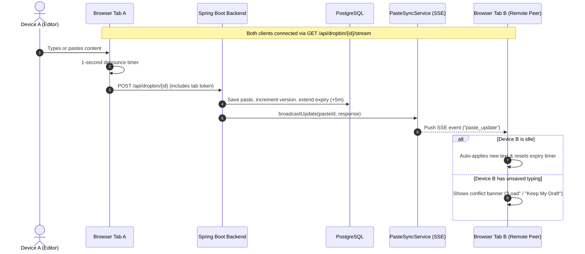

# 📦 DropBin Live — Ephemeral Real-Time Collaborative Pad & File Sharing

[](https://www.oracle.com/java/)
[](https://spring.io/projects/spring-boot)
[](https://www.postgresql.org/)
[](https://developer.mozilla.org/en-US/docs/Web/API/Server-sent_events)
[](LICENSE)

**DropBin Live** is an ephemeral, real-time collaborative text pad and temporary file-sharing hub. It allows any device on a local network (or web) to instantly create or join a pad, type collaboratively with live multi-device synchronization, and share documents up to 10MB. Everything auto-expires after **5 minutes of inactivity**, keeping storage clean and private.

---

## ✨ Features

- ✍️ **Always-in-Edit-Mode Text Editor**: Zero-click editing with line-number gutter, live character/word/line counters, and Tab indentation support.
- 💾 **Debounced Auto-Save & Beacon**: Changes automatically persist 1 second after you stop typing, via `Ctrl+S`, or upon navigating away using `navigator.sendBeacon`.
- 🔄 **Real-Time Multi-Device Sync (SSE)**: Powered by Server-Sent Events (`SseEmitter`). Edits from one PC or phone reflect instantly on all other connected screens without websockets or third-party cloud services.
- 🛡️ **Smart Conflict Protection**: If another device pushes updates while you are actively typing locally, DropBin avoids clobbering your draft and presents a non-intrusive prompt (*Load* vs. *Dismiss*).
- 📎 **10MB Multi-Format File Sharing**: Drag-and-drop or browse files (Images: PNG, JPG, WEBP, SVG; PDFs; Word `.doc` / `.docx`).
- 👁️ **Inline Lightbox Preview & Direct Download**: Built-in modal image preview and dedicated preview/download routes for documents.
- ⏱️ **5-Minute Inactivity Auto-Expiry**: Resets dynamically on every text edit or file upload. Includes a live countdown timer in the header.
- 🧹 **Automatic Cleanup Worker**: Background scheduled task runs every 60 seconds (`@Scheduled`) to purge expired pastes and delete uploaded files from disk.
- 🌐 **Zero-Config LAN Sharing**: Automatically detects host LAN IP address and generates copyable URLs for instant cross-device sharing across phones, laptops, and workstations on the same Wi-Fi.

---

## 🏛️ Architecture & Real-Time Sync Flow

DropBin uses a lightweight, resilient hybrid sync architecture combining **debounced HTTP persistence**, **Server-Sent Events (SSE)**, and **status polling fallback**:



---

## 🛠️ Tech Stack

- **Backend**: Java 17+, Spring Boot 3.2.4 (Spring Web, Spring Data JPA, Validation)
- **Database**: PostgreSQL 16 (with indexed `expires_at` column for fast cleanup)
- **Real-Time Mechanism**: Spring Web `SseEmitter` (Server-Sent Events) + Client-side `EventSource`
- **Frontend**: Thymeleaf, Vanilla Modern JavaScript (ES6+), Vanilla CSS3 (Custom properties, dark aesthetics, responsive layout)
- **Storage**: Local filesystem disk storage (`uploads/{pasteId}/...`) with safe path-traversal prevention

---

## 🚀 Quick Start

### 1. Prerequisites
- [JDK 17+](https://adoptium.net/) or higher
- [Docker](https://www.docker.com/) & Docker Compose (for PostgreSQL)
- Maven 3.8+ (or use the included `./mvnw`)

### 2. Start PostgreSQL with Docker
Run the included `docker-compose.yml`:
```bash
docker compose up -d
```
*This starts a PostgreSQL 16 instance on port `5432` with database `textbin` and initializes schema indexes from `init.sql`.*

### 3. Configure Database Credentials
Verify or update `src/main/resources/application.properties` (or set environment variables):
```properties
spring.datasource.url=jdbc:postgresql://localhost:5432/textbin
spring.datasource.username=textbin_user
spring.datasource.password=changeme
```

### 4. Run the Application
Run via Maven wrapper:
```bash
# Linux / macOS
./mvnw spring-boot:run

# Windows PowerShell
./mvnw.cmd spring-boot:run
```

Once started, open your browser at:
- **Localhost**: [http://localhost:8080](http://localhost:8080)
- **Local Network**: `http://<your-lan-ip>:8080` (displayed right on the app header and share modal)

---

## 🧭 URL & Routing Structure

| Route | Method | Description |
|---|---|---|
| `/dropbin` | `GET` | Landing page to create or open a named pad |
| `/dropbin/new` | `GET` | Generates a random alphanumeric pad ID and redirects |
| `/dropbin/{id}` | `GET` | Main live collaborative editor view for pad `{id}` |
| `/dropbin/{id}/raw` | `GET` | Plain text raw view of bin content |
| `/{id}` | `GET` | Convenient shortcut redirecting to `/dropbin/{id}` |

---

## 📡 REST API Reference

### Text & Pad Endpoints

#### Save / Update Pad Content
`POST /api/dropbin/{id}`
- **Payload**:
  ```json
  {
    "content": "Updated note or code snippet...",
    "title": "meeting-notes",
    "syntaxLanguage": "plaintext",
    "clientToken": "tab_x98f21"
  }
  ```
- **Response**: `200 OK` with updated `PasteResponse` object (includes new version and timestamp).

#### Real-Time SSE Stream
`GET /api/dropbin/{id}/stream`
- **Response**: `text/event-stream`
- Emits events:
  - `init`: Fired upon successful initial connection.
  - `paste_update`: Broadcasts updated text payload, version, and author token.
  - `file_uploaded`: Broadcasts uploaded file metadata DTO.
  - `file_deleted`: Broadcasts deleted file ID.

#### Get Pad Status (Lightweight Polling)
`GET /api/dropbin/{id}/status`
- **Response**:
  ```json
  {
    "id": "meeting-notes",
    "version": 4,
    "updatedAt": "2026-09-25T11:45:00Z",
    "contentLength": 1042
  }
  ```

#### Get Full Pad Details
`GET /api/dropbin/{id}`
- **Response**: `200 OK` with complete pad JSON.

---

### File Sharing Endpoints (Up to 10MB)

| Endpoint | Method | Description |
|---|---|---|
| `/api/dropbin/{pasteId}/files` | `POST` | Upload file (multipart form field: `file`) |
| `/api/dropbin/{pasteId}/files` | `GET` | List all active attached files for the pad |
| `/api/dropbin/{pasteId}/files/{fileId}` | `DELETE` | Delete an attached file |
| `/dropbin/{pasteId}/files/{fileId}/view` | `GET` | Inline viewer (Images / PDFs) |
| `/dropbin/{pasteId}/files/{fileId}/download` | `GET` | Download attachment with original filename header |

---

## ⚙️ Configuration Reference

Key properties in [`src/main/resources/application.properties`](src/main/resources/application.properties):

```properties
# Server bind configuration
server.port=8080
server.address=0.0.0.0

# File Upload Limits (10MB max file size)
spring.servlet.multipart.max-file-size=10MB
spring.servlet.multipart.max-request-size=12MB

# Database Configuration
spring.datasource.url=jdbc:postgresql://localhost:5432/textbin
spring.datasource.username=textbin_user
spring.datasource.password=changeme

# Connection Pool (HikariCP)
spring.datasource.hikari.maximum-pool-size=10
spring.datasource.hikari.minimum-idle=2

# Hibernate & Template Cache
spring.jpa.hibernate.ddl-auto=update
spring.thymeleaf.cache=false
```

---

## 📂 Project Structure

```text
dropbin/
├── .vscode/                     # IDE debug & launch configurations
├── docker-compose.yml           # PostgreSQL service configuration
├── init.sql                     # Initial database indexes
├── pom.xml                      # Maven project configuration
├── README.md                    # Project documentation
├── uploads/                     # Ephemeral file attachments directory (git-ignored)
└── src/
    ├── main/
    │   ├── java/com/textbin/
    │   │   ├── TextbinApplication.java    # Application entry point & @EnableScheduling
    │   │   ├── config/WebConfig.java      # CORS and resource handlers
    │   │   ├── controller/
    │   │   │   ├── FileController.java    # File upload, view, download & deletion
    │   │   │   ├── PasteApiController.java# REST API for auto-save, status, & SSE stream
    │   │   │   └── PasteController.java   # UI web page routes & redirects
    │   │   ├── dto/                       # Request & Response DTOs
    │   │   ├── model/                     # JPA Entities (Paste, BinFile)
    │   │   ├── repository/                # Spring Data Repositories
    │   │   ├── service/
    │   │   │   ├── CleanupService.java    # 60s background task for expired purge
    │   │   │   ├── FileStorageService.java# Disk storage and file category validator
    │   │   │   ├── PasteService.java      # Pad business logic & version management
    │   │   │   └── PasteSyncService.java  # In-memory SseEmitter real-time broker
    │   │   └── util/NetworkUtil.java      # Local LAN IP resolution
    │   └── resources/
    │       ├── application.properties     # Application settings
    │       ├── static/                    # CSS stylesheets and icons
    │       └── templates/                 # Thymeleaf views (index.html, view.html)
    └── test/                              # Unit & integration tests
```

---

## 🔒 Production & Deployment Best Practices

When deploying DropBin in a production environment:

1. **Reverse Proxy (Nginx / Caddy)**:
   Place Nginx or Caddy in front of the application for SSL/TLS termination and enable SSE proxy buffering off:
   ```nginx
   location /api/dropbin/ {
       proxy_pass http://localhost:8080;
       proxy_set_header Connection '';
       proxy_http_version 1.1;
       chunked_transfer_encoding off;
       proxy_buffering off;
       proxy_cache off;
   }
   ```
2. **Environment Variables**:
   Inject sensitive credentials like `SPRING_DATASOURCE_URL`, `SPRING_DATASOURCE_USERNAME`, and `SPRING_DATASOURCE_PASSWORD` via environment variables rather than hardcoding in properties files.
3. **Hibernate DDL Auto**:
   Set `spring.jpa.hibernate.ddl-auto=validate` once initial tables and indexes are created.
4. **Thymeleaf Template Cache**:
   Set `spring.thymeleaf.cache=true` in production to optimize template parsing.

---

## 📄 License

This project is licensed under the [MIT License](LICENSE).
